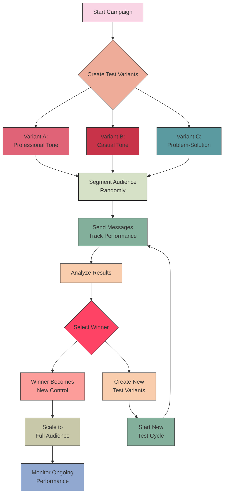

```mermaid
flowchart TD
    A[Start Campaign] --> B{Create Test Variants}
    B --> C1[Variant A:<br/>Professional Tone]
    B --> C2[Variant B:<br/>Casual Tone]
    B --> C3[Variant C:<br/>Problem-Solution]
    
    C1 --> D[Segment Audience<br/>Randomly]
    C2 --> D
    C3 --> D
    
    D --> E[Send Messages<br/>Track Performance]
    
    E --> F[Analyze Results]
    F --> G{Select Winner}
    
    G --> H1[Winner Becomes<br/>New Control]
    G --> H2[Create New<br/>Test Variants]
    
    H1 --> I[Scale to<br/>Full Audience]
    H2 --> J[Start New<br/>Test Cycle]
    
    I --> K[Monitor Ongoing<br/>Performance]
    J --> E
    
    style A fill:#f9d5e5,stroke:#333,stroke-width:1px
    style B fill:#eeac99,stroke:#333,stroke-width:1px
    style C1 fill:#e06377,stroke:#333,stroke-width:1px
    style C2 fill:#c83349,stroke:#333,stroke-width:1px
    style C3 fill:#5b9aa0,stroke:#333,stroke-width:1px
    style D fill:#d6e1c7,stroke:#333,stroke-width:1px
    style E fill:#83af9b,stroke:#333,stroke-width:1px
    style F fill:#f9cdad,stroke:#333,stroke-width:1px
    style G fill:#fe4365,stroke:#333,stroke-width:1px
    style H1 fill:#fc9d9a,stroke:#333,stroke-width:1px
    style H2 fill:#f9cdad,stroke:#333,stroke-width:1px
    style I fill:#c8c8a9,stroke:#333,stroke-width:1px
    style J fill:#83af9b,stroke:#333,stroke-width:1px
    style K fill:#91a8d0,stroke:#333,stroke-width:1px
```
