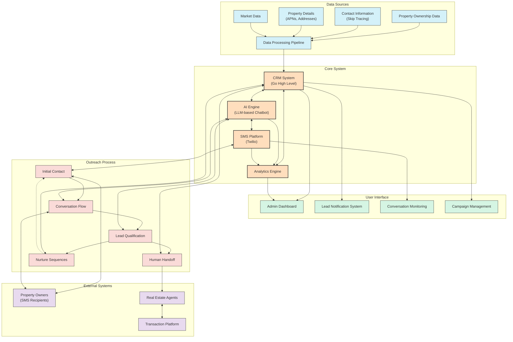

```mermaid
graph TD
    subgraph "Data Sources"
        A1["Property Ownership Data"] --> A2["Data Processing Pipeline"]
        A3["Contact Information<br/>(Skip Tracing)"] --> A2
        A4["Property Details<br/>(APNs, Addresses)"] --> A2
        A5["Market Data"] --> A2
    end

    subgraph "Core System"
        B1["CRM System<br/>(Go High Level)"]
        B2["AI Engine<br/>(LLM-based Chatbot)"]
        B3["SMS Platform<br/>(Twilio)"]
        B4["Analytics Engine"]
        
        A2 --> B1
        B1 <--> B2
        B2 <--> B3
        B1 <--> B4
        B2 --> B4
        B3 --> B4
    end
    
    subgraph "User Interface"
        C1["Admin Dashboard"]
        C2["Lead Notification System"]
        C3["Conversation Monitoring"]
        C4["Campaign Management"]
        
        B1 --> C1
        B1 --> C2
        B3 --> C3
        B1 --> C4
        B4 --> C1
    end
    
    subgraph "Outreach Process"
        D1["Initial Contact"]
        D2["Conversation Flow"]
        D3["Lead Qualification"]
        D4["Human Handoff"]
        D5["Nurture Sequences"]
        
        D1 --> D2
        D2 --> D3
        D3 --> D4
        D3 --> D5
        D5 -.-> D1
    end
    
    B3 <--> D1
    B2 <--> D2
    B2 <--> D3
    B1 <--> D4
    B1 <--> D5
    
    subgraph "External Systems"
        E1["Property Owners<br/>(SMS Recipients)"]
        E2["Real Estate Agents"]
        E3["Transaction Platform"]
        
        D1 <--> E1
        D2 <--> E1
        D4 --> E2
        E2 <--> E3
    end
    
    style A1 fill:#d4f1f9,stroke:#333,stroke-width:1px
    style A2 fill:#d4f1f9,stroke:#333,stroke-width:1px
    style A3 fill:#d4f1f9,stroke:#333,stroke-width:1px
    style A4 fill:#d4f1f9,stroke:#333,stroke-width:1px
    style A5 fill:#d4f1f9,stroke:#333,stroke-width:1px
    
    style B1 fill:#ffdebd,stroke:#333,stroke-width:2px
    style B2 fill:#ffdebd,stroke:#333,stroke-width:2px
    style B3 fill:#ffdebd,stroke:#333,stroke-width:2px
    style B4 fill:#ffdebd,stroke:#333,stroke-width:2px
    
    style C1 fill:#d5f5e3,stroke:#333,stroke-width:1px
    style C2 fill:#d5f5e3,stroke:#333,stroke-width:1px
    style C3 fill:#d5f5e3,stroke:#333,stroke-width:1px
    style C4 fill:#d5f5e3,stroke:#333,stroke-width:1px
    
    style D1 fill:#fadbd8,stroke:#333,stroke-width:1px
    style D2 fill:#fadbd8,stroke:#333,stroke-width:1px
    style D3 fill:#fadbd8,stroke:#333,stroke-width:1px
    style D4 fill:#fadbd8,stroke:#333,stroke-width:1px
    style D5 fill:#fadbd8,stroke:#333,stroke-width:1px
    
    style E1 fill:#e8daef,stroke:#333,stroke-width:1px
    style E2 fill:#e8daef,stroke:#333,stroke-width:1px
    style E3 fill:#e8daef,stroke:#333,stroke-width:1px
```
