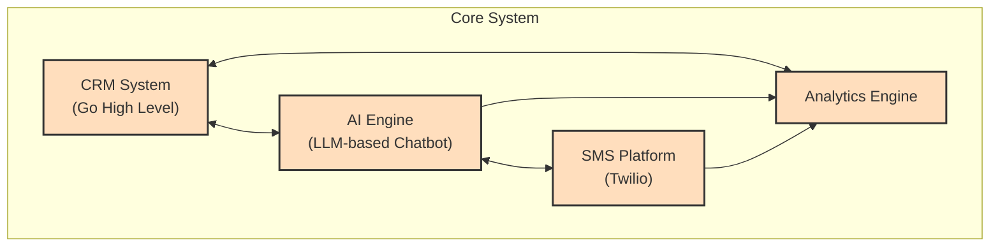

```mermaid
graph TD
    subgraph "Core System"
        B1["CRM System<br/>(Go High Level)"]
        B2["AI Engine<br/>(LLM-based Chatbot)"]
        B3["SMS Platform<br/>(Twilio)"]
        B4["Analytics Engine"]
        
        B1 <--> B2
        B2 <--> B3
        B1 <--> B4
        B2 --> B4
        B3 --> B4
    end
    
    style B1 fill:#ffdebd,stroke:#333,stroke-width:2px
    style B2 fill:#ffdebd,stroke:#333,stroke-width:2px
    style B3 fill:#ffdebd,stroke:#333,stroke-width:2px
    style B4 fill:#ffdebd,stroke:#333,stroke-width:2px
```
