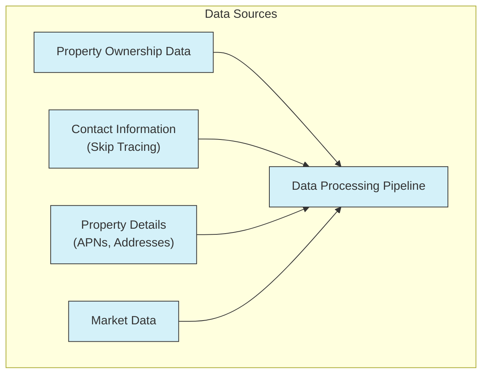

```mermaid
graph TD
    subgraph "Data Sources"
        A1["Property Ownership Data"] --> A2["Data Processing Pipeline"]
        A3["Contact Information<br/>(Skip Tracing)"] --> A2
        A4["Property Details<br/>(APNs, Addresses)"] --> A2
        A5["Market Data"] --> A2
    end
    
    style A1 fill:#d4f1f9,stroke:#333,stroke-width:1px
    style A2 fill:#d4f1f9,stroke:#333,stroke-width:1px
    style A3 fill:#d4f1f9,stroke:#333,stroke-width:1px
    style A4 fill:#d4f1f9,stroke:#333,stroke-width:1px
    style A5 fill:#d4f1f9,stroke:#333,stroke-width:1px
```
