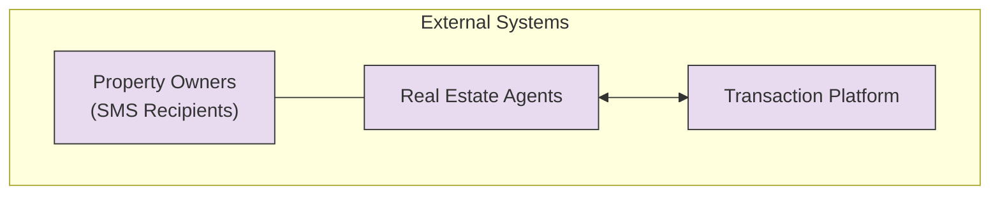

```mermaid
graph TD
    subgraph "External Systems"
        E1["Property Owners<br/>(SMS Recipients)"]
        E2["Real Estate Agents"]
        E3["Transaction Platform"]
        
        E1 --- E2
        E2 <--> E3
    end
    
    style E1 fill:#e8daef,stroke:#333,stroke-width:1px
    style E2 fill:#e8daef,stroke:#333,stroke-width:1px
    style E3 fill:#e8daef,stroke:#333,stroke-width:1px
```
