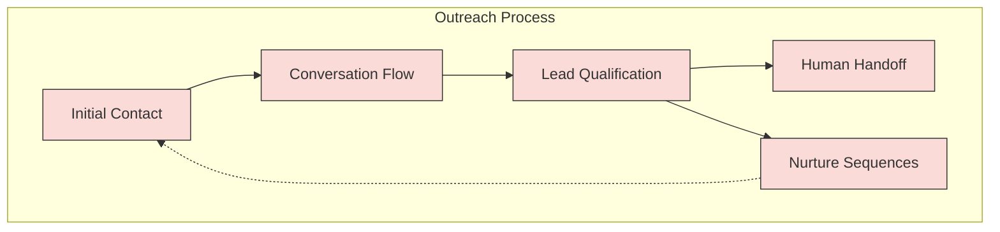

```mermaid
graph TD
    subgraph "Outreach Process"
        D1["Initial Contact"]
        D2["Conversation Flow"]
        D3["Lead Qualification"]
        D4["Human Handoff"]
        D5["Nurture Sequences"]
        
        D1 --> D2
        D2 --> D3
        D3 --> D4
        D3 --> D5
        D5 -.-> D1
    end
    
    style D1 fill:#fadbd8,stroke:#333,stroke-width:1px
    style D2 fill:#fadbd8,stroke:#333,stroke-width:1px
    style D3 fill:#fadbd8,stroke:#333,stroke-width:1px
    style D4 fill:#fadbd8,stroke:#333,stroke-width:1px
    style D5 fill:#fadbd8,stroke:#333,stroke-width:1px
```
