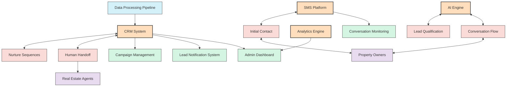

```mermaid
graph TD
    %% Data Sources to Core System
    A2["Data Processing Pipeline"] --> B1["CRM System"]
    
    %% Core System to User Interface
    B1 --> C1["Admin Dashboard"]
    B1 --> C2["Lead Notification System"]
    B3["SMS Platform"] --> C3["Conversation Monitoring"]
    B1 --> C4["Campaign Management"]
    B4["Analytics Engine"] --> C1
    
    %% Core System to Outreach Process
    B3 <--> D1["Initial Contact"]
    B2["AI Engine"] <--> D2["Conversation Flow"]
    B2 <--> D3["Lead Qualification"]
    B1 <--> D4["Human Handoff"]
    B1 <--> D5["Nurture Sequences"]
    
    %% Outreach Process to External Systems
    D1 <--> E1["Property Owners"]
    D2 <--> E1
    D4 --> E2["Real Estate Agents"]
    
    style A2 fill:#d4f1f9,stroke:#333,stroke-width:1px
    style B1 fill:#ffdebd,stroke:#333,stroke-width:2px
    style B2 fill:#ffdebd,stroke:#333,stroke-width:2px
    style B3 fill:#ffdebd,stroke:#333,stroke-width:2px
    style B4 fill:#ffdebd,stroke:#333,stroke-width:2px
    style C1 fill:#d5f5e3,stroke:#333,stroke-width:1px
    style C2 fill:#d5f5e3,stroke:#333,stroke-width:1px
    style C3 fill:#d5f5e3,stroke:#333,stroke-width:1px
    style C4 fill:#d5f5e3,stroke:#333,stroke-width:1px
    style D1 fill:#fadbd8,stroke:#333,stroke-width:1px
    style D2 fill:#fadbd8,stroke:#333,stroke-width:1px
    style D3 fill:#fadbd8,stroke:#333,stroke-width:1px
    style D4 fill:#fadbd8,stroke:#333,stroke-width:1px
    style D5 fill:#fadbd8,stroke:#333,stroke-width:1px
    style E1 fill:#e8daef,stroke:#333,stroke-width:1px
    style E2 fill:#e8daef,stroke:#333,stroke-width:1px
```
