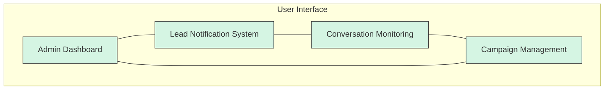

```mermaid
graph TD
    subgraph "User Interface"
        C1["Admin Dashboard"]
        C2["Lead Notification System"]
        C3["Conversation Monitoring"]
        C4["Campaign Management"]
        
        C1 --- C2
        C2 --- C3
        C3 --- C4
        C4 --- C1
    end
    
    style C1 fill:#d5f5e3,stroke:#333,stroke-width:1px
    style C2 fill:#d5f5e3,stroke:#333,stroke-width:1px
    style C3 fill:#d5f5e3,stroke:#333,stroke-width:1px
    style C4 fill:#d5f5e3,stroke:#333,stroke-width:1px
```
