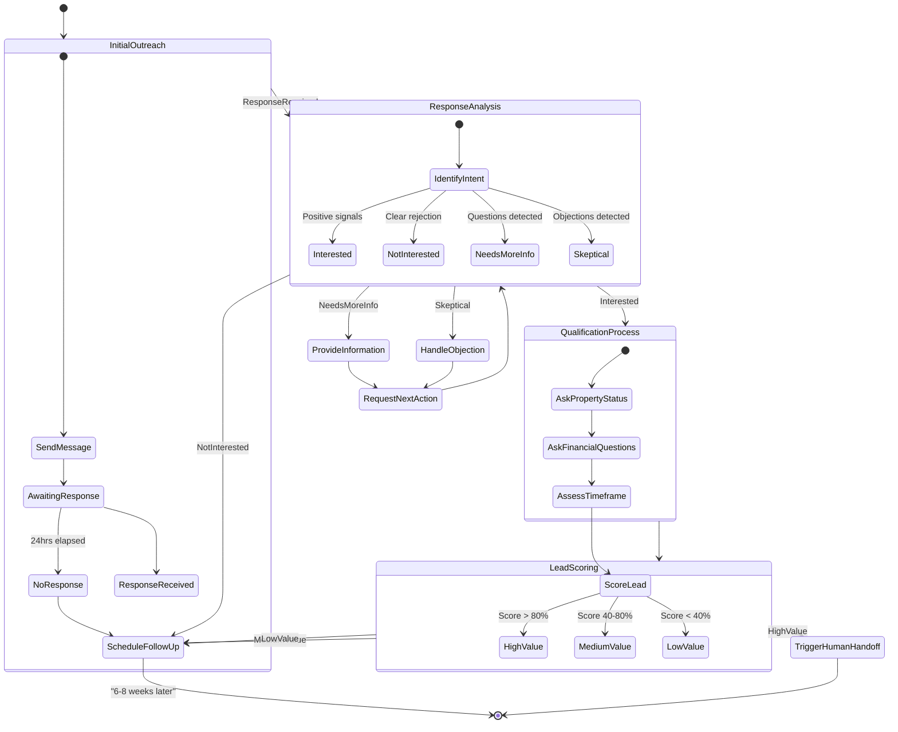

```mermaid
stateDiagram-v2
    [*] --> InitialOutreach
    
    state InitialOutreach {
        [*] --> SendMessage
        SendMessage --> AwaitingResponse
        AwaitingResponse --> NoResponse: 24hrs elapsed
        NoResponse --> ScheduleFollowUp
        AwaitingResponse --> ResponseReceived
    }
    
    InitialOutreach --> ResponseAnalysis: ResponseReceived
    
    state ResponseAnalysis {
        [*] --> IdentifyIntent
        IdentifyIntent --> Interested: Positive signals
        IdentifyIntent --> NotInterested: Clear rejection
        IdentifyIntent --> NeedsMoreInfo: Questions detected
        IdentifyIntent --> Skeptical: Objections detected
    }
    
    state QualificationProcess {
        [*] --> AskPropertyStatus
        AskPropertyStatus --> AskFinancialQuestions
        AskFinancialQuestions --> AssessTimeframe
        AssessTimeframe --> ScoreLead
    }
    
    ResponseAnalysis --> QualificationProcess: Interested
    ResponseAnalysis --> ScheduleFollowUp: NotInterested
    
    ScheduleFollowUp --> [*]: "6-8 weeks later"
    
    ResponseAnalysis --> ProvideInformation: NeedsMoreInfo
    ResponseAnalysis --> HandleObjection: Skeptical
    
    ProvideInformation --> RequestNextAction
    HandleObjection --> RequestNextAction
    
    RequestNextAction --> ResponseAnalysis
    
    state LeadScoring {
        ScoreLead --> HighValue: Score > 80%
        ScoreLead --> MediumValue: Score 40-80%
        ScoreLead --> LowValue: Score < 40%
    }
    
    QualificationProcess --> LeadScoring
    
    LeadScoring --> TriggerHumanHandoff: HighValue
    LeadScoring --> ScheduleFollowUp: MediumValue
    LeadScoring --> ScheduleFollowUp: LowValue
    
    TriggerHumanHandoff --> [*]
```
