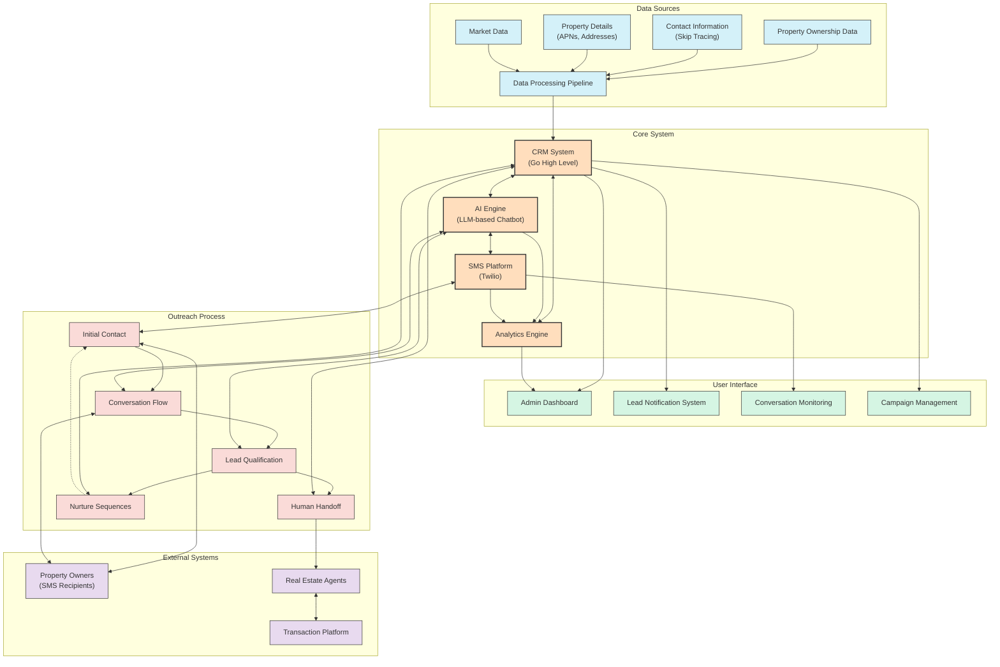
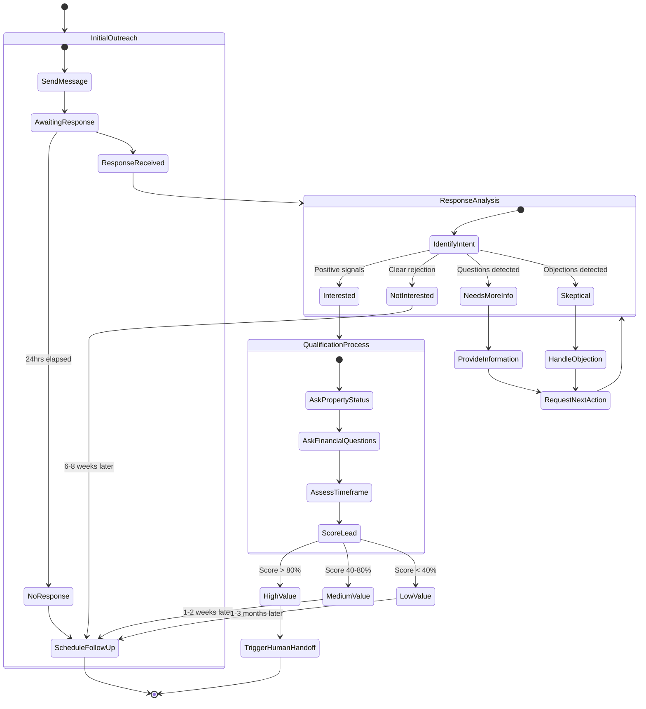
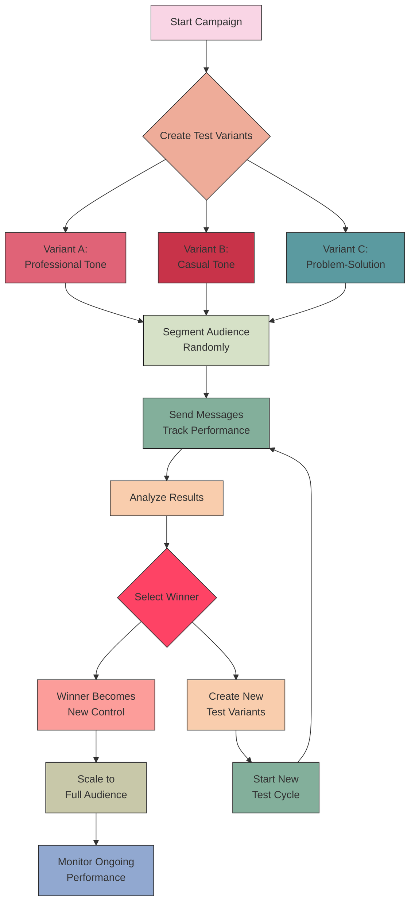

# System Architecture Diagram

```mermaid
graph TD
    subgraph "Data Sources"
        A1["Property Ownership Data"] --> A2["Data Processing Pipeline"]
        A3["Contact Information<br/>(Skip Tracing)"] --> A2
        A4["Property Details<br/>(APNs, Addresses)"] --> A2
        A5["Market Data"] --> A2
    end

    subgraph "Core System"
        B1["CRM System<br/>(Go High Level)"]
        B2["AI Engine<br/>(LLM-based Chatbot)"]
        B3["SMS Platform<br/>(Twilio)"]
        B4["Analytics Engine"]
        
        A2 --> B1
        B1 <--> B2
        B2 <--> B3
        B1 <--> B4
        B2 --> B4
        B3 --> B4
    end
    
    subgraph "User Interface"
        C1["Admin Dashboard"]
        C2["Lead Notification System"]
        C3["Conversation Monitoring"]
        C4["Campaign Management"]
        
        B1 --> C1
        B1 --> C2
        B3 --> C3
        B1 --> C4
        B4 --> C1
    end
    
    subgraph "Outreach Process"
        D1["Initial Contact"]
        D2["Conversation Flow"]
        D3["Lead Qualification"]
        D4["Human Handoff"]
        D5["Nurture Sequences"]
        
        D1 --> D2
        D2 --> D3
        D3 --> D4
        D3 --> D5
        D5 -.-> D1
    end
    
    B3 <--> D1
    B2 <--> D2
    B2 <--> D3
    B1 <--> D4
    B1 <--> D5
    
    subgraph "External Systems"
        E1["Property Owners<br/>(SMS Recipients)"]
        E2["Real Estate Agents"]
        E3["Transaction Platform"]
        
        D1 <--> E1
        D2 <--> E1
        D4 --> E2
        E2 <--> E3
    end
    
    style A1 fill:#d4f1f9,stroke:#333,stroke-width:1px
    style A2 fill:#d4f1f9,stroke:#333,stroke-width:1px
    style A3 fill:#d4f1f9,stroke:#333,stroke-width:1px
    style A4 fill:#d4f1f9,stroke:#333,stroke-width:1px
    style A5 fill:#d4f1f9,stroke:#333,stroke-width:1px
    
    style B1 fill:#ffdebd,stroke:#333,stroke-width:2px
    style B2 fill:#ffdebd,stroke:#333,stroke-width:2px
    style B3 fill:#ffdebd,stroke:#333,stroke-width:2px
    style B4 fill:#ffdebd,stroke:#333,stroke-width:2px
    
    style C1 fill:#d5f5e3,stroke:#333,stroke-width:1px
    style C2 fill:#d5f5e3,stroke:#333,stroke-width:1px
    style C3 fill:#d5f5e3,stroke:#333,stroke-width:1px
    style C4 fill:#d5f5e3,stroke:#333,stroke-width:1px
    
    style D1 fill:#fadbd8,stroke:#333,stroke-width:1px
    style D2 fill:#fadbd8,stroke:#333,stroke-width:1px
    style D3 fill:#fadbd8,stroke:#333,stroke-width:1px
    style D4 fill:#fadbd8,stroke:#333,stroke-width:1px
    style D5 fill:#fadbd8,stroke:#333,stroke-width:1px
    
    style E1 fill:#e8daef,stroke:#333,stroke-width:1px
    style E2 fill:#e8daef,stroke:#333,stroke-width:1px
    style E3 fill:#e8daef,stroke:#333,stroke-width:1px
```

## AI Bot Conversation Flow Diagram

```mermaid
stateDiagram-v2
    [*] --> InitialOutreach
    
    state InitialOutreach {
        [*] --> SendMessage
        SendMessage --> AwaitingResponse
        AwaitingResponse --> NoResponse: 24hrs elapsed
        NoResponse --> ScheduleFollowUp
        AwaitingResponse --> ResponseReceived
    }
    
    state ResponseAnalysis {
        [*] --> IdentifyIntent
        IdentifyIntent --> Interested: Positive signals
        IdentifyIntent --> NotInterested: Clear rejection
        IdentifyIntent --> NeedsMoreInfo: Questions detected
        IdentifyIntent --> Skeptical: Objections detected
    }
    
    ResponseReceived --> ResponseAnalysis
    
    state QualificationProcess {
        [*] --> AskPropertyStatus
        AskPropertyStatus --> AskFinancialQuestions
        AskFinancialQuestions --> AssessTimeframe
        AssessTimeframe --> ScoreLead
    }
    
    Interested --> QualificationProcess
    NotInterested --> ScheduleFollowUp: 6-8 weeks later
    NeedsMoreInfo --> ProvideInformation
    Skeptical --> HandleObjection
    
    ProvideInformation --> RequestNextAction
    HandleObjection --> RequestNextAction
    
    RequestNextAction --> ResponseAnalysis
    
    ScoreLead --> HighValue: Score > 80%
    ScoreLead --> MediumValue: Score 40-80%
    ScoreLead --> LowValue: Score < 40%
    
    HighValue --> TriggerHumanHandoff
    MediumValue --> ScheduleFollowUp: 1-2 weeks later
    LowValue --> ScheduleFollowUp: 1-3 months later
    
    TriggerHumanHandoff --> [*]
    ScheduleFollowUp --> [*]
```

## A/B Testing Implementation

```mermaid
flowchart TD
    A[Start Campaign] --> B{Create Test Variants}
    B --> C1[Variant A:<br/>Professional Tone]
    B --> C2[Variant B:<br/>Casual Tone]
    B --> C3[Variant C:<br/>Problem-Solution]
    
    C1 --> D[Segment Audience<br/>Randomly]
    C2 --> D
    C3 --> D
    
    D --> E[Send Messages<br/>Track Performance]
    
    E --> F[Analyze Results]
    F --> G{Select Winner}
    
    G --> H1[Winner Becomes<br/>New Control]
    G --> H2[Create New<br/>Test Variants]
    
    H1 --> I[Scale to<br/>Full Audience]
    H2 --> J[Start New<br/>Test Cycle]
    
    I --> K[Monitor Ongoing<br/>Performance]
    J --> E
    
    style A fill:#f9d5e5,stroke:#333,stroke-width:1px
    style B fill:#eeac99,stroke:#333,stroke-width:1px
    style C1 fill:#e06377,stroke:#333,stroke-width:1px
    style C2 fill:#c83349,stroke:#333,stroke-width:1px
    style C3 fill:#5b9aa0,stroke:#333,stroke-width:1px
    style D fill:#d6e1c7,stroke:#333,stroke-width:1px
    style E fill:#83af9b,stroke:#333,stroke-width:1px
    style F fill:#f9cdad,stroke:#333,stroke-width:1px
    style G fill:#fe4365,stroke:#333,stroke-width:1px
    style H1 fill:#fc9d9a,stroke:#333,stroke-width:1px
    style H2 fill:#f9cdad,stroke:#333,stroke-width:1px
    style I fill:#c8c8a9,stroke:#333,stroke-width:1px
    style J fill:#83af9b,stroke:#333,stroke-width:1px
    style K fill:#91a8d0,stroke:#333,stroke-width:1px
```
